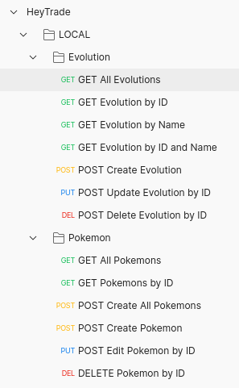
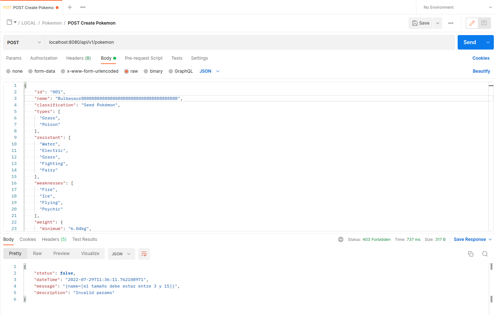
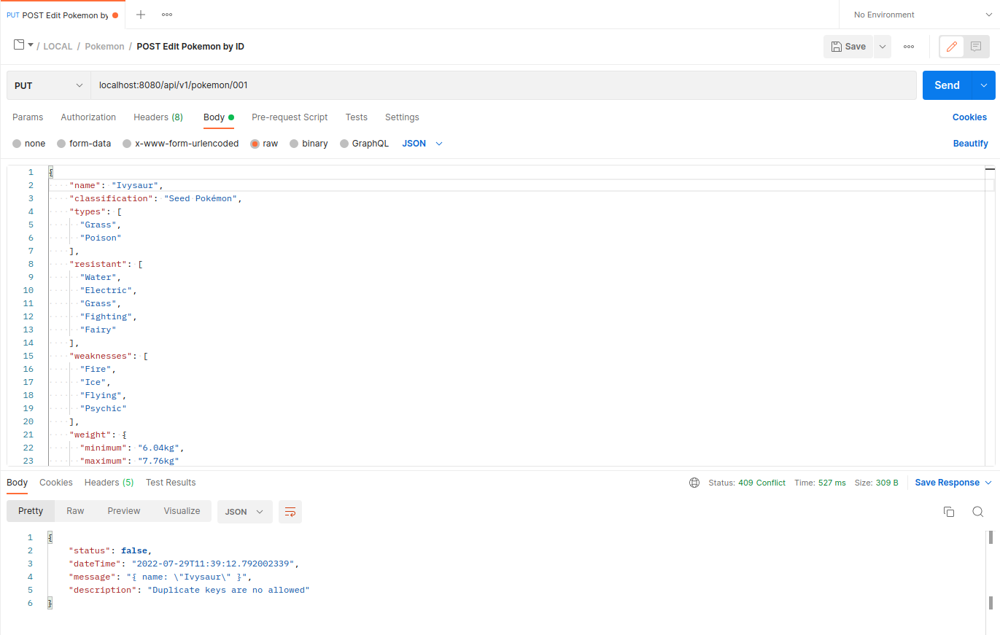
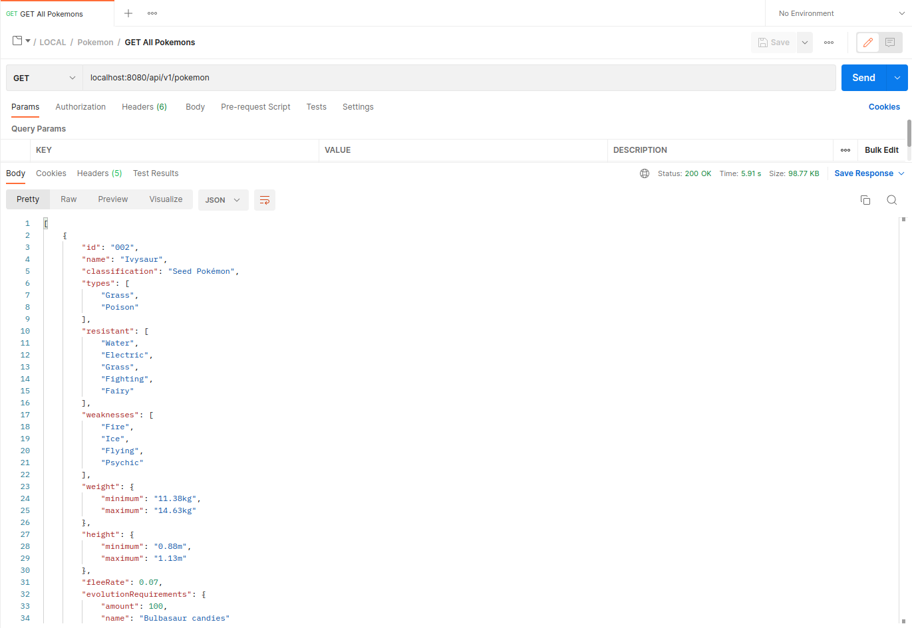
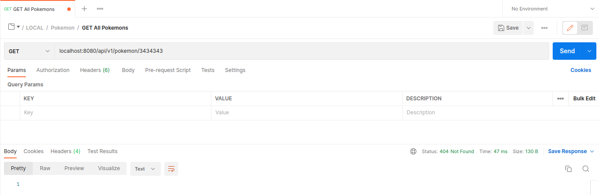
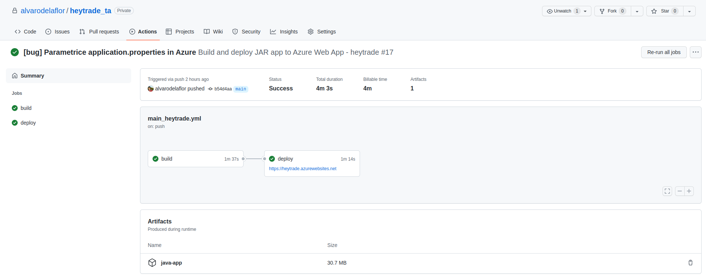
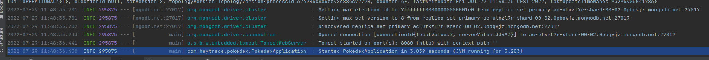
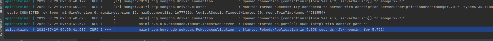

# HeyTrade

## Summary

As a broad summary, the CRUD of an API has been built using Spring, as required.

A security layer has been included in this API using a JWT token for all EndPoints.

Finally, we have taken into account the inclusion of CI/CD, in this case using GitHub Actions and Azure. Every commit on the repo in the master layer triggers an action that will check the build, pass the tests and if everything is correct it will be uploaded to Azure.

## Development

### *CRUD*

Firstly, it should be noted that the entire development has been carried out using the TDD strategy.

    Create a REST API that allows you to perform CRUD operations for a "Pokemon" as the one given in the example exercise.


```java
package com.heytrade.pokedex.domain;

import com.fasterxml.jackson.annotation.JsonInclude;
import com.fasterxml.jackson.annotation.JsonProperty;
import com.heytrade.pokedex.domain.attack.Attaks;
import com.heytrade.pokedex.validation.ValidateDecimalConstraint;
import lombok.AllArgsConstructor;
import lombok.Data;
import lombok.EqualsAndHashCode;
import org.springframework.data.annotation.Id;
import org.springframework.data.mongodb.core.index.Indexed;
import org.springframework.data.mongodb.core.mapping.DBRef;
import org.springframework.data.mongodb.core.mapping.Document;

import javax.validation.Valid;
import javax.validation.constraints.*;
import java.util.List;

@Data
@Document
@AllArgsConstructor
@JsonInclude(JsonInclude.Include.NON_NULL)
@EqualsAndHashCode
public class Pokemon {

    @Id
    private String id;
    @Indexed(unique=true)
    @NotNull
    @NotBlank
    @Size(min = 3, max = 15)
    private String name;
    @NotNull
    @NotBlank
    @Size(min = 3, max = 35)
    private String classification;
    private List<@NotNull @NotBlank @Size(min = 3, max = 10) String> types;
    private List<@NotNull @NotBlank @Size(min = 3, max = 10) String> resistant;
    private List<@NotNull @NotBlank @Size(min = 3, max = 10) String> weaknesses;
    @NotNull
    @Valid
    private Weight weight;
    @NotNull
    @Valid
    private Height height;
    @NotNull
    @ValidateDecimalConstraint
    private Double fleeRate;
    @JsonProperty("Previous evolution(s)")
    @DBRef
    private List<@Valid Evolution> previousEvolutions;
    @NotNull
    @Valid
    private EvolutionRequirements evolutionRequirements;
    @DBRef
    private List<@Valid Evolution> evolutions;
    @NotNull
    @Min(0)
    @Max(10000)
    private Integer maxCP;
    @NotNull
    @Min(0)
    @Max(10000)
    private Integer maxHP;
    @NotNull
    @Valid
    private Attaks attacks;
}

```

As you can see in the excerpt above, it has been decided to use MongoDB (and in our case MongoDB Atlas) as the database.

**The required endpoints have been developed and for each of them the appropriate verifications have been taken into account, which will be discussed below.**



1. **POST /api/v1/pokemon**

   It will create a new pokemon from the values passed in the Request Body.

   An example of a valid Request Body could be:

        {
           "id": "001",
           "name": "Bulbasaur",
           "classification": "Seed Pokémon",
           "types": [
              "Grass",
              "Poison"
           ],
           "resistant": [
                 "Water",
                 "Electric",
                 "Grass",
                 "Fighting",
                 "Fairy"
                 ],
           "weaknesses": [
                 "Fire",
                 "Ice",
                 "Flying",
                 "Psychic"
           ],
           "weight": {
                 "minimum": "6.04kg",
                 "maximum": "7.76kg"
           },
                 "height": {
                 "minimum": "0.61m",
                 "maximum": "0.79m"
           },
           "fleeRate": 0.1,
           "evolutionRequirements": {
                 "amount": 25,
                 "name": "Bulbasaur candies"
           },
           "evolutions": [
                 {
                       "id": 2,
                       "name": "Ivysaur"
                 },
                 {
                       "id": 3,
                       "name": "Venusaur"
                 }
           ],
           "maxCP": 951,
           "maxHP": 1071,
           "attacks": {
                 "fast": [
                     {
                           "name": "Tackle",
                           "type": "Normal",
                           "damage": 12
                     },
                     {
                           "name": "Vine Whip",
                           "type": "Grass",
                           "damage": 7
                     }
                 ],
                 "special": [
                     {
                           "name": "Power Whip",
                           "type": "Grass",
                           "damage": 70
                     },
                     {
                           "name": "Seed Bomb",
                           "type": "Grass",
                           "damage": 40
                     },
                     {
                           "name": "Sludge Bomb",
                           "type": "Poison",
                           "damage": 55
                     }
                 ]
           }
        }

   Here, as in the other routes, we have used validator annotation to check the validity of the action. both spring and self-developed (you can see them in the [folder](./src/main/java/com/heytrade/pokedex/validation)).

   For this particular case it is checked:

   > Attributes are neither null nor empty.

   > String(types, resistant, weaknesses) have to be between 3 and 10 characters.

   > Weight has a custom validator that checks that it follows a correct format, you can see the implementation in this [file](./src/main/java/com/heytrade/pokedex/validation/impl/WeightValidatorImpl.java)

   > Height has a custom validator that checks that it follows a correct format, you can see the implementation in this [file](./src/main/java/com/heytrade/pokedex/validation/impl/HeightValidatorImpl.java)
    
   > fleeRate has a custom validator that checks that it follows a correct format, you can see the implementation in this [file](./src/main/java/com/heytrade/pokedex/validation/impl/ValidateDecimalConstraintImpl.java)
    
   > Evolution (name) have to be between 3 and 15 characters.
   
   > maxCP and maxHP have to be between 0 and 10000.
    
   > Attacks have to be valid values as defined in his domain for each implementation. 

   If any of the criteria is not met, a 403 code will be returned with a message explaining the error, as you can see in the following screenshot.

   

   In the case of trying to create a pokemon with an existing key, a 409 will be returned with an identifying message as shown in the following screenshot.

   

   In case it is successfully created, a message with code 200 and with a message body equal to the created pokemon.

2. **GET /api/v1/pokemon**

   It will display a list of all the pokemons in the database.

   

3. **GET /api/pokemon/[:id]**

   The database pokemon containing the given ID as variable path will be displayed.

   If it is not found, a message with a 404 code will be returned indicating that it cannot be found.

   

4. **PUT /api/pokemon/[:id]**

   Any value of the pokemon can be updated, following the same restrictions and procedure as for the create option, but adding the ID as a variable path.

   If it does not exist, a 404 will be returned as above.

6. **DELETE /api/pokemon/[:id]**

   Delete from the database the pokemon with id indicated by path variable.

   If it does not exist, a 404 will be returned as above.

   If positive, a 200 message will be returned.

If an uncontrolled error occurs, a 500 shall be returned with a message identifying that an error has occurred.

TDD has been used for all development, i.e. no new code was developed until a failed test occurred.

### *JWT* #TODO

It has been decided that all endpoints must pass through a JWT token-based security layer in order to be used, the development of which can be seen in this [file](./).

Before any request can be made, a valid and unexpired token must be obtained to the path /api/auth

The POSTMAN files have been configured in such a way that the token is captured and distributed without the need to copy and paste it on each call.

First the POST call is invoked to get it and save it as a variable.


It is then captured at each endpoint and sent in the header.


As you can see, if the token is not found, a message with a 401 code is sent.

In the case of an expert, a 401 code is also returned but explained in the body of the message.


### *DOCKER & DOCKER-COMPOSE*

To improve compatibility in any environment, the entire application, including the database, has been dockerised.

The difference between using the application through docker is that MongoDB is used through a container instead of contacting MongoDB Atlas and the port has been changed from 80 to 8080 to avoid conflict so that both can be used at the same time without conflict.

To use it you only need to use the command "docker-compose up".

### *MAKEFILE*

To facilitate the use of the application locally, the Makefile configuration file has been added:

**make java** -> it will deploy the application locally

**make docker** -> will run the tests and if none fail, it will deploy the application using the "docker-compose" file (port 80 modifiable in the .env file)

### *Azure*


I have decided to use just another of the best known services, Azure.


### *GitHub Actions*

Taking advantage of the decision to use Azure, it has been decided to use GitHub Actions as an orchestrator for CI and CD.

As you can see in this [file](./.github/workflows/main_heytrade.yml), it has been designed so that as each commit to master the application tests are launched, in case they do not fail and the build is correct, it is deployed in Azure.

The life cycle would be like the following:



First, the action of doing the build and passing the tests is performed. In case nothing fails, it proceeds to deploy it in azure.

## How to use

You will first need to import the environment, i.e. you need to import this configuration [file](./POSTMAN/taxDown.postman_environment.json) into your POSTMAN application. Once this is done, you have three options:

1. **Use Azure**

   You will need to import [this collection](./POSTMAN/HeyTrade.postman_collection.json) and use AZURE folder. The first mandatory step will be to use the endpoint TOKEN. You don't have to worry about anything else as this is automatically propagated by the Postman application, so you can use any endpoint you want until it expires, at which point you need to regenerate it.

2. **Use local Java**

   You will need to run the "make java" command. Until a message like this appears in the console:

   

   Once this is done, you can repeat what was explained in case 1, but using folder LOCAL.

3. **Use Docker compose**

   You will need to run the "make docker" command. Until a message like this appears in the console:

   

   Once this is done, you can repeat what was explained in case 1, but using folder DOCKER.

## Future improvements:

1. API documentation (using for example Swagger)
2. Authentication using credentials evaluated on get token
3. Code refactoring
4. Test improvements
5. Add parameters not considered
6. ...